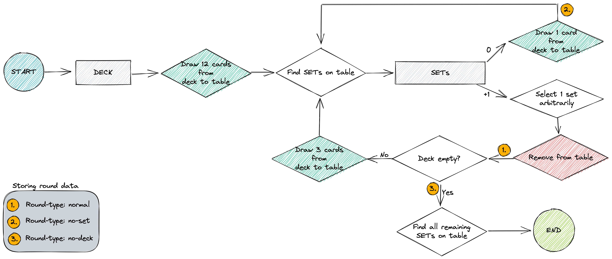

# Set simulation

> Set is a fun cardgame
## Game flow

## How to set up repo for development

1. Prerequisites:
   1. Pyenv (install with `brew install pyenv`),
   2. Python 3.8.1 (install with `Pyenv install 3.8.1`),
   3. Pyenv virtualenv plugin (install with `brew install pyenv-virtualenv`)
2. Set the .python-version file to whatever Python version you have/want to use
3. Test with `pyenv versions` from the terminal

## Columns of SET simulation data

1. `game_id` - the ID of a complete game of SET
2. `round_id` - the ID of a round in SET which includes looking for SETs, removing one (if any) and replacing the removed cards from the deck (if any). `game_id` and `round_id` are the keys of the table.
3. `round_type` - one of three types:
   1. `normal` - deck not empty, at least 1 SET found
   2. `no-set` - deck not empty, no SETs found
   3. `no-deck` - deck empty, looking for set
4. `is_first_round` - True if first round, False otherwise
5. `is_last_round` - True if last round, False otherwise
6. `date_time`
8. `num_cards_table` - number of cards on the table at the beginning of the round
9. `num_cards_deck` - number of cards in the deck at the beginning of the round
10. `num_sets` - number of SETs at the beginning of the round
11. `cards_table` - cards on the table
12. `cards_deck` - cards in the deck
13. `sets` - cards of SETs grouped
14. `chosen_set`
